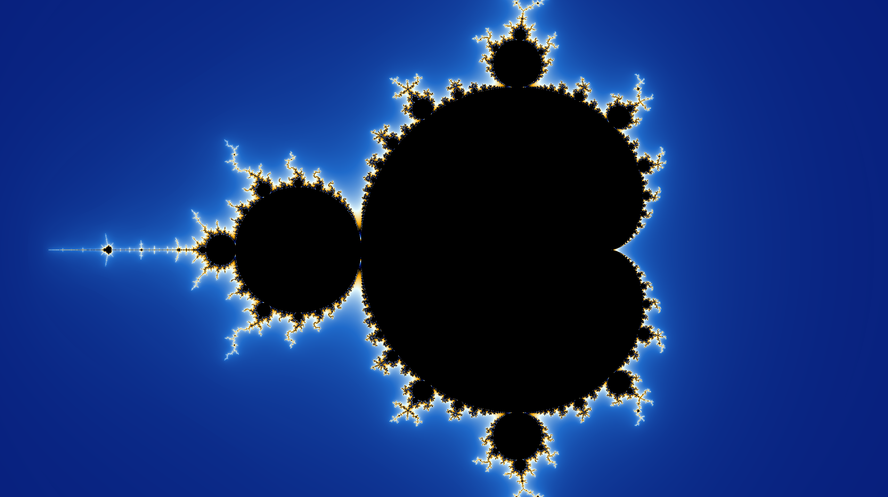
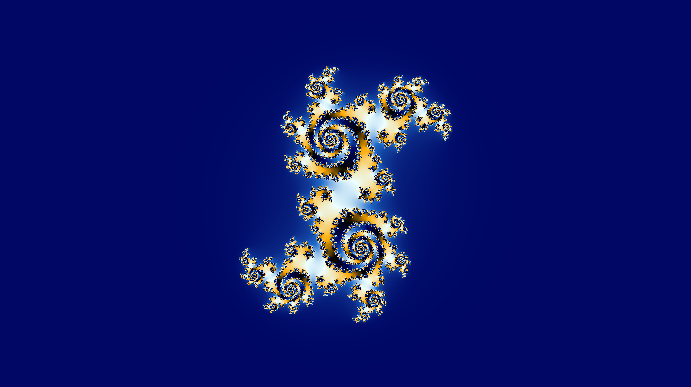
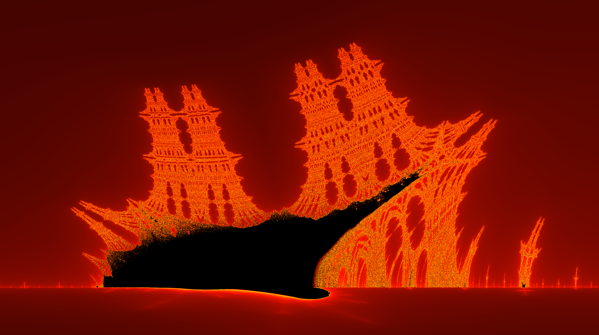
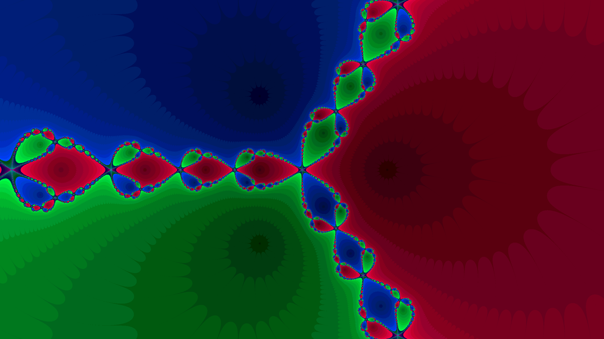

# RedFract-ol

## Overview

This project is a fractal generator implemented in C, created for the 42's school. The program is capable of rendering various types of fractals, providing a visually appealing exploration of mathematical patterns. The supported fractals include:

- **Mandelbrot**
- **All Julia Sets**
- **Burningship**
- **Newton**

## Features

- **Zoom Functionality:** Use the mouse wheel to zoom in and out.
- **Pan Control:** Navigate through the fractal space using the arrow keys or using right click.
- **Color Themes:** Switch between different color themes by pressing the '1' numpad key.
- **Smooth Rendering:** Toggle smooth rendering on and off by pressing '2'.
- **Interactive Julia Set:** In Julia sets, press the space bar to dynamically change the Julia parameters using the mouse.

## Screenshots

*Mandelbrot fractal*

*Julia 0.355 + 0.355i set*

*Burningship fractal*

*Newton fractal*

## Usage

1. Clone the repository to your local machine.
2. Compile the source code using a C compiler.
3. Run the executable to explore the fractal world.

## Dependencies

The project has no external dependencies beyond standard C libraries and the MiniLibX provided by 42.

## Author

* [**Contré Yavin**](https://github.com/TheRedShip) : Creator of the project.

Happy fractal exploring! 🌀
